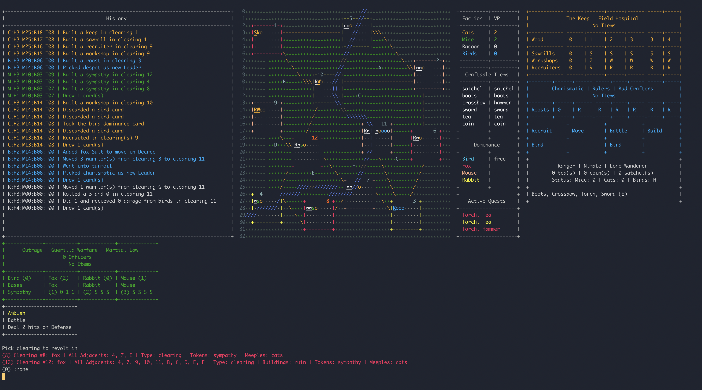
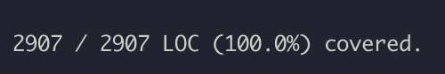

# Root

This is my (first) take on a digital version of Root.

This version is complete, except, I guess the AI isn't very good ;)

It works, I'm happy with it as a learning exercise, but it's being deprecated while I work on the full version.

## Gameplay

It's a full game run through, you start the game, it'll show you relevant information on each of the factions.

Whatever their game boards would normally display.

The Cats for example, show how many more buildings they have on their track, the Birds have their decree.

The option showing was the best part, with the ability to undo and select different options.

## The Why

It was really fun building something that was more of a long runnng process, and building out a complicated system.

All while keeping the entire thing at 100% code coverage, and 100% branch coverage.

A commit never went below 99% code coverage.

Does that mean the tests are good and cover everything? No :) But was it a very good experience to do and work on? Yes.

## Installation

Run this command, master is "broken" for playing purposes. It's not broken for transition purposes.

`git clone --single-branch --branch display-backup git@github.com:ayellapragada/root.git`

## Usage

Run `./bin/play FACTION_CODE`

Where the FACTION_CODE is `cats`, `birds`, `mice`, or `racooon`.

## License

The gem is available as open source under the terms of the [MIT License](https://opensource.org/licenses/MIT).

## Code of Conduct

Everyone interacting in the root project's codebases, issue trackers, chat rooms and mailing lists is expected to follow the [code of conduct](https://github.com/[USERNAME]/root/blob/master/CODE_OF_CONDUCT.md).
